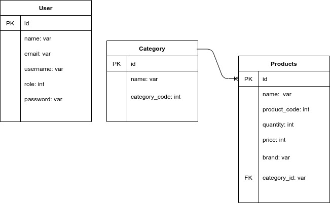

## Take Home Project

  [](https://github.com/kobiyoyo/bikeshop/actions)


## Database Schema
  

## How to Use
To setup files and the app run
```
bundle install
rails db:create

```
Run seed data
```
rails db:seed
```
Login Details
```
Email: john@gmail.com Password 01234Admin
```
To run test suite
```
bundle exec rspec 
```
## API Documentation
#### Sign in
     POST  api/v1/auth
```
     {
      "username":"chubi",
      "password":"123234566"
      
      } 
```

#### Signup
      POST /users
```
    {
        "email": "test@email.com",
        "password": "1234567",
        "username": "dan",
        "name": "danile adama"
    }
 ```
#### Category
###### List all categories
     GET api/v1/categories
###### Create categories
     POST api/v1/categories
```
	{
	"name": "bike" ,
     "category_code": 232
	}
```
###### Edit categories
    PATCH api/v1/categories/24
```
	{
	 "name": "bike" ,
     "category_code": 232
	}

 ```

###### Delete categories
	DELETE api/v1/categories/25


#### Product
###### List all products
     GET api/v1/products

###### Create product
     POST api/v1/products
```
	{
     "name": "bike",
     "product_code": 232,
     "quantity":  12 ,
     "price":   123.2,
     "brand":  "nike",
     "category_id": 1
	}
```
###### Edit product
    PATCH api/v1/products/24
 ```
	{
	 "name": "bike",
     "product_code": 232,
     "quantity":  12 ,
     "price":   123.2,
     "brand":  "nike",
     "category_id": 1
	}

 ```
###### Delete product
	DELETE api/v1/products/25


## Architecture
- There are three entities created in this project (user, category, product)
- The Category entity handles the categorization of products , it can be used as a filter for proucts.
- The Product entity includes all list of products available for sale.
- The Users can signup through the signup link . 

## Backend
- Ruby on Rails - the web framework used to build the api .
- Rspec - testing framework
- PostgreSQL -  the main reason PostgreSQL is used , in a case where there is a migration failure while modifying your database records , the entire modification gets rolled back to where you started instead of crashing like  MySQL.
- RSpec API Doc Generator - for api documentation(couldnt do it because of time)


## Requirements

#### Ksec
- [x] The user should be able to see a list of products.
- [x] The user must authenticate using a username and password.
- [x] The user must be able to create, edit and delete products.
- [x] User must be able to create, edit and delete categories

#### Note 
